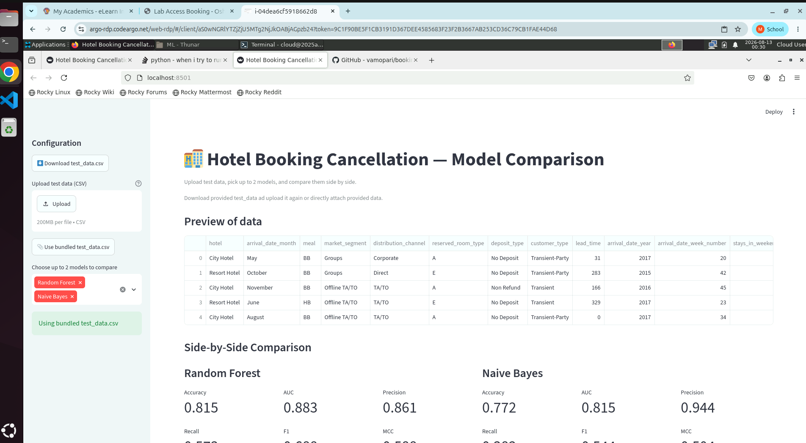

## Discussion: Precision/Recall Trade-off (Logistic Regression)

Default Logistic Regression (threshold = 0.5): Accuracy 0.809, Precision 0.839, Recall 0.598, F1 0.699, MCC 0.582.

Using `class_weight="balanced"`: Accuracy 0.787, Precision 0.709, Recall 0.721, F1 0.715, MCC 0.545.

AUC stayed identical (0.852) in both cases — `class_weight` shifts the decision
threshold's effective trade-off point but doesn't change the model's underlying
ranking ability. We kept the default (unweighted) model for consistency across
all 5 models, but in a real deployment, the choice would depend on which error
is costlier for the hotel: a missed cancellation (lost resale opportunity) vs.
a false alarm (unnecessary overbooking prep). If missed cancellations are
costlier, the balanced version's higher recall (0.721 vs 0.598) would likely
be the better production choice despite the drop in precision.

# Hotel Booking Cancellation Prediction



## a. Problem Statement
Hotel cancellations disrupt revenue forecasting and room inventory planning
for hospitality businesses. This project builds and compares five
classification models to predict whether a hotel booking will be
**cancelled** or **not cancelled**, based on booking, guest, and stay
details known at the time of reservation. A Streamlit app lets a user
upload test data, pick a model, and inspect its performance interactively.

## b. Dataset Description
- **Source:** Hotel Booking Demand dataset — booking records from a city
  hotel and a resort hotel (~119,390 rows total).
- **Instances:** 119,390 (well above the 500-instance minimum).
- **Features used:** 24 (well above the 12-feature minimum) — 16 numeric
  (lead_time, adr, previous_cancellations, total_of_special_requests, etc.)
  and 8 categorical (hotel, meal, market_segment, deposit_type, etc.).
- **Target:** `is_canceled` (1 = cancelled, 0 = not cancelled) — moderately
  imbalanced at ~63% / 37%.
- **Columns dropped and why:**
  - `reservation_status`, `reservation_status_date` — **data leakage**:
    these directly encode the outcome (e.g. `Check-Out` vs `Canceled`) and
    would not be known at the time a real prediction is needed.
  - `company` (94% missing), `agent` (14% missing) — too sparse to be
    reliable features.
  - `country` — high cardinality (170+ values), small % missing.
  - `assigned_room_type` — only known *after* check-in, not at booking
    time; excluded for the same "not available at prediction time" reason
    as the leakage columns above.
  - `arrival_date_day_of_month` — low predictive signal, dropped as noise.

## c. GitHub Repository Link
`https://github.com/vamopari/booking-analysis`

## d. Models Used and Comparison

| Model | Accuracy | AUC | Precision | Recall | F1 | MCC |
|---|---|---|---|---|---|---|
| Logistic Regression | 0.809 | 0.852 | 0.839 | 0.598 | 0.699 | 0.582 |
| Decision Tree | 0.820 | 0.878 | 0.849 | 0.624 | 0.719 | 0.606 |
| kNN | 0.793 | 0.848 | 0.775 | 0.620 | 0.689 | 0.544 |
| Naive Bayes | 0.755 | 0.784 | 0.941 | 0.361 | 0.522 | 0.481 |
| Random Forest (Ensemble) | 0.816 | 0.889 | 0.883 | 0.579 | 0.699 | 0.601 |

*(Regenerate this table any time with `pixi run python model/train.py` —
it writes the same numbers to `model/metrics_comparison.csv`.)*

### Observations

| Model | Observation |
|---|---|
| Logistic Regression | Solid linear baseline; can't capture feature interactions (e.g. deposit_type + lead_time combined), which caps its recall. |
| Decision Tree | Beats the linear baseline on every metric by capturing non-linear splits and interactions; depth capped at 10 to avoid overfitting. |
| kNN | Trained on a 15,000-row stratified sample (not the full ~95K) to keep the deployed model small and fast — costs a little accuracy vs. the full-data version we tested, but keeps Streamlit deployment lightweight. Prediction is also far slower than the other models since it computes distances against stored training points at inference time (~26s for the full-data version vs. under a second for the others). |
| Naive Bayes | Weakest model overall (lowest AUC, F1, MCC) but with by far the highest precision. Its independence assumption between correlated features (e.g. deposit_type and previous_cancellations) makes it very conservative about predicting "cancelled" — it misses most real cancellations (recall 0.361) but is rarely wrong when it does flag one. |
| Random Forest (Ensemble) | Best AUC (0.889) and precision (0.883) — averaging many trees improves ranking quality over a single tree. Recall is middling here, likely because both the single tree and the forest were depth-capped at 10 for a fair comparison, constraining how much individual trees could specialize before averaging. |
| **Best overall** | **Random Forest** for ranking quality (AUC) and precision; **kNN** for recall/F1 if catching more true cancellations matters more than avoiding false alarms. The right choice depends on which error — a missed cancellation or a false alarm — is costlier for the business. |

## Discussion: Precision/Recall Trade-off (Logistic Regression)
Default Logistic Regression (threshold = 0.5): Accuracy 0.809, Precision 0.839, Recall 0.598, F1 0.699, MCC 0.582.

Using `class_weight="balanced"`: Accuracy 0.787, Precision 0.709, Recall 0.721, F1 0.715, MCC 0.545.

AUC stayed identical (0.852) in both cases — `class_weight` shifts the decision
threshold's effective trade-off point but doesn't change the model's underlying
ranking ability. We kept the default (unweighted) model for consistency across
all 5 models, but in a real deployment, the choice would depend on which error
is costlier for the hotel: a missed cancellation (lost resale opportunity) vs.
a false alarm (unnecessary overbooking prep). If missed cancellations are
costlier, the balanced version's higher recall (0.721 vs 0.598) would likely
be the better production choice despite the drop in precision.

## Project Structure

booking-analysis/
├── app.py ← Streamlit app (in progress)
├── requirements.txt
├── README.md
├── test_data.csv ← 1,000-row sample for the app's upload demo
├── data/ ← not committed; see "How to Run" below
├── src/
│ └── preprocessing.py ← shared preprocessing pipeline
└── model/
├── train.py ← trains and saves all 5 models
├── logistic_regression.joblib
├── decision_tree.joblib
├── knn.joblib
├── naive_bayes.joblib
├── random_forest.joblib
└── metrics_comparison.csv

## How to Run Locally
```bash
# 1. Install pixi if you don't have it: https://pixi.sh
pixi install

# 2. Download the dataset (not committed to the repo, ~17MB)
mkdir -p data
curl -sL -o data/hotels.csv "https://raw.githubusercontent.com/rfordatascience/tidytuesday/master/data/2020/2020-02-11/hotels.csv"

# 3. (Optional) retrain all 5 models from scratch
pixi run python model/train.py

# 4. Launch the app
pixi run streamlit run app.py
```

## Live Links
- **Streamlit App:** https://vishal-mopari.streamlit.app/
- **BITS Virtual Lab Screenshot:** `<ADD ONCE CAPTURED>`
